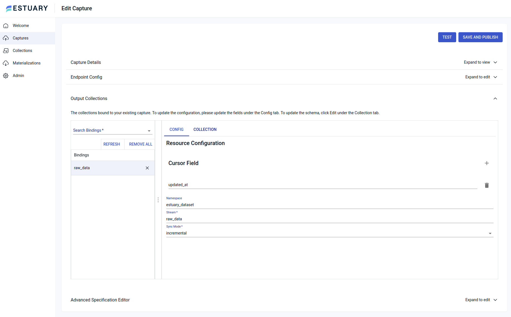
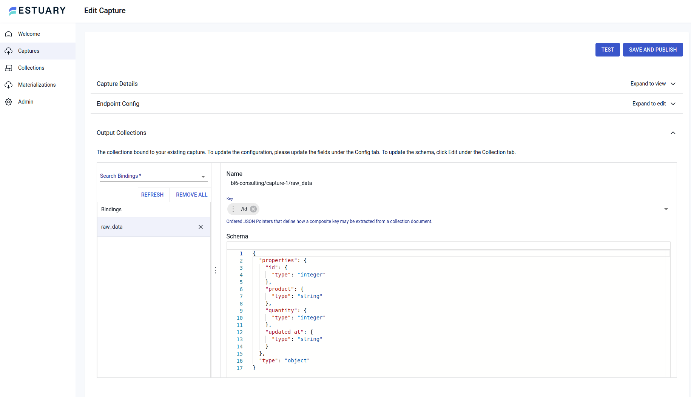

## Background

A large part of my current work involves working with well known tools of the modern data stack (dbt, Fivetran, Stitch, Cloud data warehouses). I wanted to explore alternative tools in order to maintain a wider perspective and understanding of the options available and where they fit in.

I came across [Estuary](https://estuary.dev/) from a Twitter thread and decided to check it out.

### Where Estuary Fits In

- **Real Time ETL**: Uses Change Data Capture (CDC) to extract data from a source to a destination in real time as standard. 
- **Specific Focus on ETL from Database to Data Warehouse**: Rather than trying to build extractors for every available data source it feels that there is a more targeted approach on database to data warehouse ETL.
- **Simplified Cost**: You can look at the pricing page and clearly see what your ETL costs will be. The price is done using the concept of a task as well as the volume of data in GB that the task will use.
- **Transform Capabilities**: I haven't look deeply into this yet but Estuary does allow for data transforms before loading to a Data Warehouse.

## Building a BigQuery to Google Sheets ETL Pipeline With Estuary

I decided to use Terraform to set up the BigQuery infrastructure needed for this pipeline.

The Terraform code is contained in this repository and you can use it by doing the following steps.

It will:

- Enable the BigQuery API
- Create a dataset and a table with a specified schema.
- Create a service account and add the necessary permissions needed by Estuary.

### Requirements

- Terraform installed on your local machine
- A Google Cloud Platform account on the free tier or with billing enabled.
- A Google account with access to Google Sheets
- [gcloud CLI](https://cloud.google.com/sdk/docs/install)

### Instructions

**Creating the infrastructure**

1. Git clone this respository locally
2. Create a file at the root of the repository called `terraform.tfvars`
3. In this file add entries for all the variables defined in the `vars.tf` file. This should look something like the below but with other values for `project_id` and `account_email`

```terraform
project_id    = "my-gcp-project-name"
region        = "us-central1"
zone          = "us-central1-c"
account_email = "email-used-to-create-gcp-account@gmail.com"
```
4. Type `gcloud auth application-default login` in your terminal and follow the prompts
5. When in the root of this repository type `terraform init` into your terminal
6. Then type `terraform fmt` in your terminal for good measure
7. Type `terraform plan -out "tfplan1"` into your terminal
8. If you are happy with the plan that Terraform shows it's time to create the infrastructure using `terraform apply "tfplan1"`

This should have create a dataset, table and a service account that can be used by estuary to extract data from.

**Inserting some Data**

Open up the GCP console and navigate to BigQuery. 

Open up a query console and run the following sql statement.

```sql
insert into `<replace-this-with-your-actual-project-id>.estuary_dataset.raw_data` (id, product, quantity, updated_at) 
values(1, 'iPhone 10', 3, current_timestamp)
```

**Create and Download JSON Credentials for the Estuary Service account**

- Open up the GCP console and using the burger menu on the left navigate to:

```txt
IAM and admin > service accounts
```
- Here you should see a service account with an email start with **estuary@**

- Click on the email address and it will open a more detailed panel for the service account

- Now click navigate through the following and choose JSON as the key type

```
KEYS > ADD KEY > Create new Key
```

- This will download the JSON credentials the estuary service account to your local machine

**Setting Up The Estuary Flow**

Creating a capture

- Navigate to [Estuary Data](https://estuary.dev/) in your browser and sign up for an account
- Click **Captures** on the left hand side burger menu and then click **+ New Capture**
- Choose **Google BigQuery** as the option
- Fill in the required fields for **Name** and **Project ID**
- Upload the JSON credentials downloaded in the section above by clicking the **USE SECRET FROM FILE** option
- Although not required, please type **estuary_dataset** in the box for **Default Dataset ID**
- Now click **NEXT** at the top
- You should now be at a section named **Output Collections**
- Here you need to do two things, which at the time of writing , are not obvious in the UI

1. In the cursor field type **updated_at**. Because BigQuery has no CDC endpoint *the cursor has to be a timestamp*



2. Click the **COLLECTION** tab and then click **EDIT**. You should see a JSON schema for the BigQuery table. If the type for **ID** and **quantity** are **number** edit these so they say **integer**. Now in the Key field just above the schema type **ID** and select it from the drop down and finall click **close**



- The capture should be set up. Click the blue **TEST** button at the top of the screen and if that is sucessful you can click the blue **SAVE AND PUBLISH** button

Creating a Materialization

- Click **Materializations** on the left hand side burger menu and then click **+ New Materialization**
- Choose **Google Sheets** as the option
- Now you will need to create a Google Sheet in your account for the data from the BigQuery capture to be loaded into.
- Once created, copy the URL up to and including **/edit** and paste it into the **Spreadsheet URL** box in the Estuary UI.
- Click the sign in with Google button to authorize Estuary to use your Google account.

- The materialization should be set up. If you open the Google Sheet you should now the data from the BigQuery table in the Google Sheet.

Play Around with Data in the BigQuery Table

- Navigate back to BigQuery and open up a query console.
- If you can open up the Google Sheet to which data is loaded so that you can see BigQuery and the Google Sheet at the same time.
- In the BigQuery query console change the quantity of the existing record using:

```sql
insert into `<replace-this-with-your-actual-project-id>.estuary_dataset.raw_data` (id, product, quantity, updated_at) 
values(1, 'iPhone 10', 999, current_timestamp)
```

- Insert another record:

```sql
insert into `<replace-this-with-your-actual-project-id>.estuary_dataset.raw_data` (id, product, quantity, updated_at) 
values(2, 'Google Pixel 7', 50, current_timestamp)
```

- Observe what happens in the Google Sheet!
